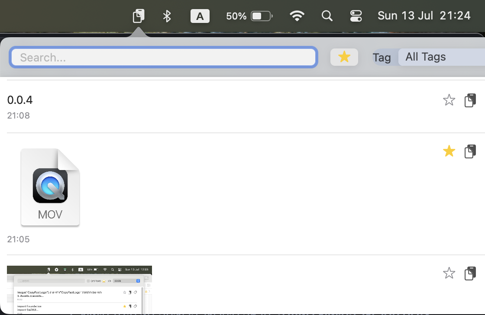

# CopyFast

  
  
  

  <strong><a href="http://copyfast.yeudaby.com/">🌐 בקר באתר הרשמי 🌐</a></strong>

CopyFast הוא מנהל לוח חכם ונוח למערכת ההפעלה macOS. הוא שומר היסטוריה של כל מה שהעתקתם (טקסטים ותמונות), ומאפשר לכם לחפש, לסנן ולנהל את ההיסטוריה בקלות, ישירות מה-MenuBar.

## הדגמה

## :rocket: פיצ'רים

- **היסטוריה חכמה:** שמירה אוטומטית של טקסטים ותמונות מהלוח. שום דבר לא הולך לאיבוד.
- **חיפוש מיידי:** מצאו כל פריט תוך שניות עם יכולות חיפוש מתקדמות.
- **ארגון וסדר:** סמנו מועדפים והוסיפו תגיות כדי לשמור על סדר ונגישות.
- **ממשק מודרני:** ממשק משתמש נקי ומודרני בהשראת macOS, עם תמיכה במצב כהה.
- **מחיקת פריטים:** נהלו את היסטוריית ההעתקות שלכם ומחקו פריטים שאינכם צריכים עוד.

## :computer: איך להשתמש

1.  **הורידו את הגרסה האחרונה** מהאתר הרשמי: **[copyfast.yeudaby.com](http://copyfast.yeudaby.com/)**
2.  פתחו את קובץ ה-`.dmg` וגררו את `CopyFast.app` לתיקיית היישומים שלכם.
3.  הפעילו את האפליקציה. היא תרוץ ברקע ותשמור את כל מה שתעתיקו.
4.  כדי לפתוח את חלון ההיסטוריה, לחצו על אייקון האפליקציה בשורת המשימות.

## :hammer_and_wrench: טכנולוגיות

- **SwiftUI:** לבניית ממשק המשתמש.
- **CoreData:** לניהול ושמירת הנתונים באופן מקומי.
- **AppKit:** לאינטגרציה עם רכיבי מערכת ההפעלה של macOS. 